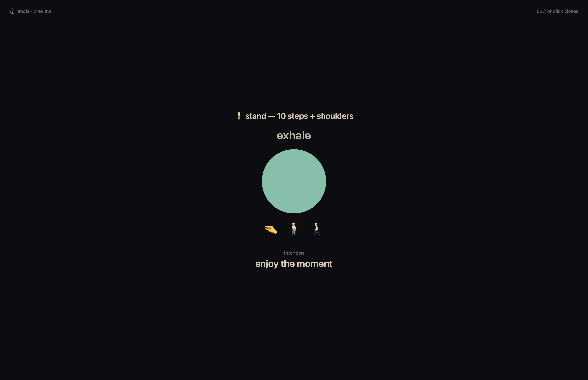
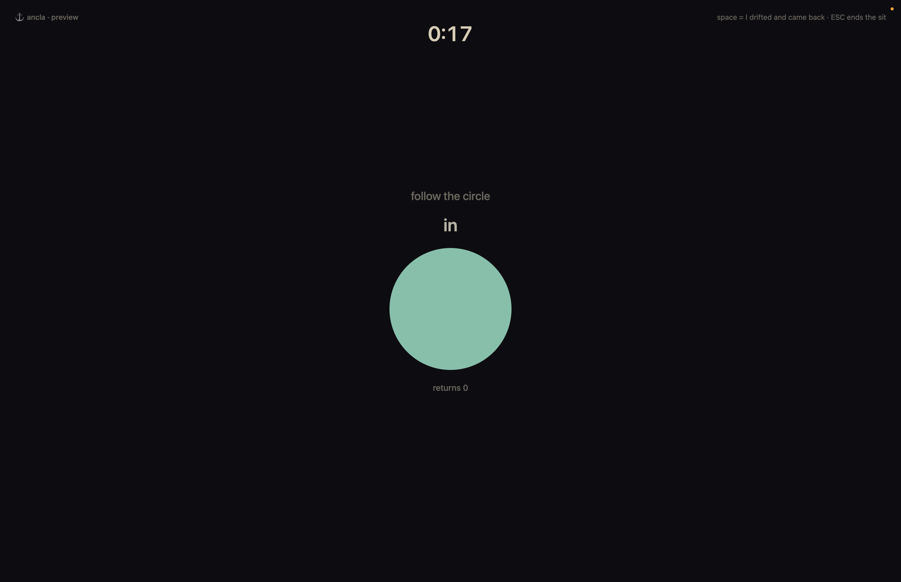

# Ancla ⚓

[](https://github.com/lout33/ancla/actions/workflows/build.yml)
[](LICENSE)


A native macOS menu bar app that interrupts you every ~20–40 minutes and conducts a 15-second regulation cycle — a full-screen breathing circle, one intention, and back to work slower than you left it.

> The two clocks: **projects fast, people slow.** One engine (urgency) wants to hurry both. Ancla is the governor — a machine whose only job is slowing you down on purpose, system-fired, zero willpower.



## The cycle (15 s, guided by a breathing circle)

1. **press** — thumb hard against the pinky. The anchor: an invisible, always-carried gesture
2. **exhale** — the circle deflates for 7 s; eyes follow the circle, lungs follow the eyes (a long exhale beats an inhale: physiological sigh)
3. **widen** — the circle expands and a field surfaces; widen the gaze to the whole room, find three things unrelated to the task
4. **people, slow** — return to work at that tempo

The exhale + peripheral-widen is the antidote to tunnel-vision fixation; the thumb-press is a proprioceptive cue the body can find faster than a thought. Practiced at the desk many times a day, the chain generalizes to real "doors" — a conversation that goes quiet, a room that feels slow, the moment before you hit send.

## Modes

| Mode | When | Shows |
|---|---|---|
| **breath** | most reps | circle + 🤏 |
| **stand / change** | every 4th rep, alternating | circle + 🤏 🧍 🚶 or 🤏 🔄 🪑 |
| **test** | every 6th rep | no guidance — *"run the cycle — you lead"* (prompt fading: the goal is the app becoming unnecessary) |
| **mission** | first rep of the day, if one is set | your one line on top of the cycle |

Every rep also shows one **intention**, picked at random for now: *understand · connect · express clearly · set a boundary · enjoy the moment*. And it pauses whatever you're watching or listening to (Music, Spotify, YouTube in a browser — anything in macOS Now Playing), resuming it when the rep ends. Media you paused yourself stays paused.

## Sits and practice log (optional, off by default)

Switch on **Morning + night sits** in the menu (or `ancla sits on`) for two 5-minute sits a day tied to your day, not to the clock alone:

- **Morning:** the first time you come back after at least 5 h away, between 05:00 and 14:00 (fires 90 s after you're back).
- **Night:** 00:30, waits while you're away until 02:00. The sit day rolls over at 03:00.
- A slot you miss is logged as missed, never fired at a wrong moment.

A sit is a full-screen circle that breathes 4 s in, 6 s out. Press **space** each time you notice you drifted and came back, and type **one word** in the last 30 s. ESC ends it early; stray clicks are ignored. Each sit lands in the practice log with its returns and word.



Every rep and sit shows a **countdown clock** at the top (`0:12`, `4:32`), so you always know how long is left.

Put if-then lines in `~/.local/state/ancla-ifthens.txt` (one per line); reps rotate through them as the intention, titled "practice". **Log ▸ training… / live rep…** (or `ancla log training|live <text>`) append to `~/.local/state/ancla-practice.csv`; the menu shows training this week against a floor of 2. Everything stays on your machine.

## Using it

Everything lives in the **⚓ menu bar item**:

- **Title** — `⚓ 12m` minutes since the last real rep · `⚓ ‖` paused · `⚓ !` something failed (open the menu to see what)
- **Status lines** — last rep, reps today, streak, and when the next rep is due (or *"fires when you're back"* if one is waiting for you)
- **Fire now** — a rep right now · **Sit now (5 min)**
- **Morning + night sits** — toggle · **Log ▸** training, live rep, practice log
- **Pause ▸** 30 min · 1 hour · 2 hours · until tomorrow (8:00) · until I resume — resumes by itself, survives restarts
- **Rhythm ▸** short 15–25 · normal 20–40 · long 40–60 min
- **Today's mission…** — type one line; it rides the next rep
- **View rep log / View events** — the CSV of reps and the diagnostic trail
- **Quit Ancla** — stays quit until next login (or `launchctl kickstart gui/$(id -u)/com.pepe.ancla`)

CLI (for agents and testing):

```bash
ancla status                  # schedule, counters, failures; exit 1 if the app isn't running
ancla fire                    # rep now in the running app
ancla preview [mode] [text]   # one overlay, touches no state (mode sit: ANCLA_SIT_SECONDS=20 shortens it)
ancla sit                     # 5-minute sit now
ancla sits on|off             # morning + night sits
ancla rhythm short|normal|long
ancla log training|live <text>
```

On the overlay: **ESC** closes it (ignored for the first 1.5 s); a **click** closes it only after 5 s, because most early clicks were reflexes, not decisions. Focus returns to the app you were in.

## Why another break app

Tools like [Glimt](https://www.glimtapp.io/) ($39), [Stretchly](https://github.com/hovancik/stretchly) and [Time Out](https://dejal.com/timeout/) do reminders and breathing well. Ancla differs on purpose:

- **15 seconds, full screen.** Not a notification, a takeover. Short enough to never cost anything, total enough to actually reset the tempo.
- **A trainable chain, not a wellness pattern.** Press → exhale → widen → people, slow is one rehearsal, repeated, not a meditation session.
- **Prompt fading.** Every 6th rep is unguided. The success metric is the app making itself unnecessary — an odd goal for a subscription, a natural one for a tool.
- **A rep counts only once it's on screen.** Counters, streaks and logs record what actually happened, and failures surface in the menu bar instead of hiding.
- **No permissions, no account, no telemetry.** One binary, `swiftc`, done.

## Reliability rules

- **A rep counts only once it is on screen.** Counters, streak and the CSV are written after the window is visible, never before.
- **Due while you're away → it waits.** Idle > 2 min or screen locked: the rep stays pending and fires when you come back. After login or wake it waits 60 s to settle.
- **Failures are loud.** Every decision (shown, waiting, paused, woke, failed) goes to `ancla-events.log`. If the process dies mid-rep, launchd restarts it, the menu shows `⚓ !`, and the next attempt waits a full interval so a crash can't loop.
- **One instance, no stale locks.** Singleton via `flock`, released by the kernel when the process dies.
- **All screens** are covered; the cycle is drawn on the screen with the mouse.

## Architecture

```
launchd (com.pepe.ancla: run at login, restart on crash only)
  └─ ~/.local/bin/Ancla.app            one process, menu bar only (LSUIElement)
       src/main.swift       entry: app | fire | preview | status; flock singleton
       src/Scheduler.swift  cadence, idle-wait, wake, pause, mode rules, crash detection
       src/Overlay.swift    full-screen panels at .screenSaver level, the 15 s cycle
       src/MenuBar.swift    ⚓ status item and menu
       src/Media.swift      pause/resume Now Playing media
       src/Store.swift      state (JSON), rep CSV, event log
```

State in `~/.local/state/`: `ancla.json` (schedule + counters), `ancla-log.csv` (one row per rep), `ancla-events.log` (diagnostics), `ancla-mission.txt`. No dependencies beyond Xcode Command Line Tools.

**Media control caveat:** since macOS 15.4, the private MediaRemote framework no longer reports playback state to third-party apps, so `Media.swift` reads it through Apple's own `osascript` (JXA, ~60 ms) and sends pause/play with `MRMediaRemoteSendCommand` directly. If a macOS update breaks this, reps still run — just without pausing. Known gap: a crash mid-rep leaves the media it paused paused.

## Install

Requires macOS 13+ and [Xcode Command Line Tools](https://developer.apple.com/xcode/) (`xcode-select --install`). No other dependencies.

```bash
git clone https://github.com/lout33/ancla.git
cd ancla
./install.sh      # build, install to ~/.local/bin, start the LaunchAgent; safe to rerun
```

```bash
./build.sh        # build only → build/Ancla.app
./test.sh         # rule checks for the scheduling logic
./uninstall.sh    # stop and remove (keeps your data; --purge deletes it too)
```

## Contributing

Issues and PRs welcome. The codebase is five small Swift files with no build system to install — `swiftc` via `./build.sh` is the whole pipeline, and `./test.sh` checks the scheduling rules. Design-wise, three constraints are load-bearing:

1. **The circle is the instruction.** Words compete with the breath; the breath is the interface.
2. **No autoregulation — pre-decisions.** The moment only executes what calm-you decided.
3. **Rejection list:** sound design, phone sync, dashboards, "smart" timing — system-building costumes.

If a change fights those, it probably belongs in a fork, and that's fine too.

## History

Built 2026-09-20 as a personal regulation practice: the body rep merged a pre-existing stand-up habit, and the breath rep carries an anchor chain for showing up calm with people. A week into using it, every rep since a small refactor had been crashing at launch while the log, counter and streak still counted each one — 15 crash reports matched 15 logged "reps", a perfect phantom streak nobody could see. That failure became the design brief for v2: count only what reached the screen, wait instead of skip, and make every failure loud.

## License

[MIT](LICENSE)
